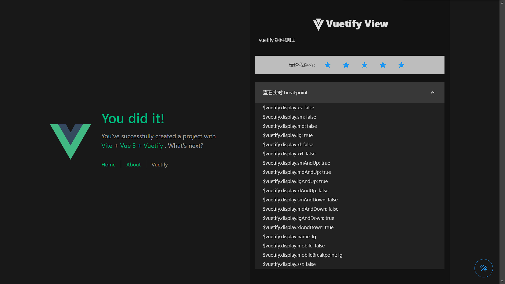

[Here](../README.md) for English Version

# vit-vue3-vuetify-ts-template

这个模板或许可以帮助你在Vite中使用Vue3 + Vuetify@next 进行开发。

## 推荐的IDE设置

[VSCode](https://code.visualstudio.com/) + [Volar](https://marketplace.visualstudio.com/items?itemName=Vue.volar) (并禁用Vetur) + [TypeScript Vue Plugin (Volar)](https://marketplace.visualstudio.com/items?itemName=Vue.vscode-typescript-vue-plugin)。

## TS中对`.vue`导入的类型支持

TypeScript默认不能处理`.vue`导入的类型信息，所以我们用`vue-tsc`代替`tsc` CLI进行类型检查。在编辑器中，我们需要[TypeScript Vue Plugin (Volar)](https://marketplace.visualstudio.com/items?itemName=Vue.vscode-typescript-vue-plugin)来使TypeScript语言服务知道`.vue`类型。

如果你觉得独立的TypeScript插件不够快，Volar也实现了一个[接管模式](https://github.com/johnsoncodehk/volar/discussions/471#discussioncomment-1361669)，性能更强。你可以通过以下步骤启用它。

1. 禁用内置的TypeScript扩展
    1) 运行`Extensions: 从VSCode的命令调色板中显示内置扩展程序
    2) 找到`TypeScript和JavaScript语言功能`，右击并选择`禁用（工作区）`。
2. 通过运行`Developer.Reload Window`来重新加载VSCode窗口。从命令调色板上重新加载窗口`。

## 自定义配置

见 [Vite配置参考](https://vitejs.dev/config/)。

## 项目设置

### 安装依赖
```sh
pnpm install
```

### 编译和热加载用于开发

```sh
pnpm dev
```

### 类型检查、编译和最小化用于生产

```sh
pnpm build
```

### 使用[ESLint](https://eslint.org/)进行提示。

```sh
pnpm lint
```

## 特性
- demo 很丑
- Vuetify@Next 注入
- TypeScript 支持
- 配置尽可能隐藏
  > 位于`package.json`和`/src/config/`文件夹下
- `Material Design` 图标支持
- build 依赖检查

## 截图

